# Food System
You can find various special food items, meals, and ingredients on this server. Every food item has its own special properties and effects on the player and/or their teammates. Be aware that these meals can spoil over time if they are not kept in a fridge! Meals also add effects on top of your [Skills](skills.md)

## Basics
In the bottom right corner, you will see four green buttons that can be clicked while you are in your inventory:
  - Meals
  - iBag
  - Cook
  - Market

### Meals
If you click on the "Meals" button, you will get an overview of the effects that your cooked meals provide. This button only works if you have some kind of meal in your inventory.

---
### iBag
This button will open an inventory. Only ingredients, such as milk, can be stored here. 
  - If you obtain an ingredient, for example by harvesting an animal, it will be automatically stored in this inventory. 
  - The iBag also functions as a fridge, so ingredients will not spoil inside it. 

---
### Cook
This will open a new overlay with four buttons: 
 - Recipes
   - This option shows you all the different kinds of meals you can craft yourself if you have the right ingredients. 
   - If you click on the image of a meal, a crafting window will open. It shows which items are needed and what effects the meal will provide. 
 - Ingredients
   - This option shows you all the different ingredients you can obtain and how to get them. 
 - Favourites
   - If you click on the star in the crafting window, the meal will be marked as a favourite and will appear in this section. 
 - Settings
   - This shows different kinds of settings that can be turned on or off. 
   - By default, they are all turned on. 

---
### Market
This button opens the Farmers Market. Here you can buy and sell a fixed amount of ingredients such as sugar, bread loaves, or cloth. 
  - To buy items, you need the amount of scrap shown under "sell price". 
  - If you sell things in the Farmers Market, you will receive the "buy price" value in scrap. 
  - This shop only has a supply if players are selling things to it.

---
## Ingredients Overview
Here you will find all the different ingredients and how to gather them.

  
🔽  <h3>INGREDIENTS</h3>🔼 

  
  
  
---
  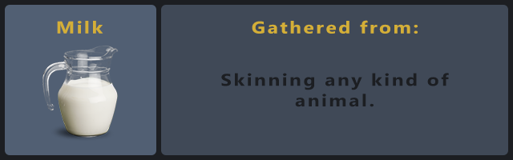

---
  

---
  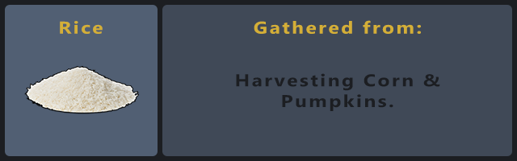

---
  

---
  

---
  
  
---
  

---
  

---
  

---
  

---
  
  
---
  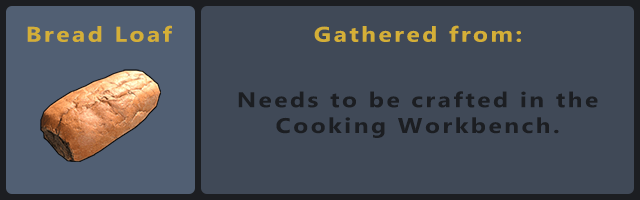

---
  

---
  

---
  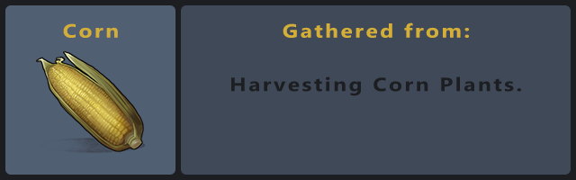

---
  

---
  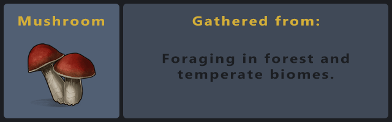

---
  

---
  

---
  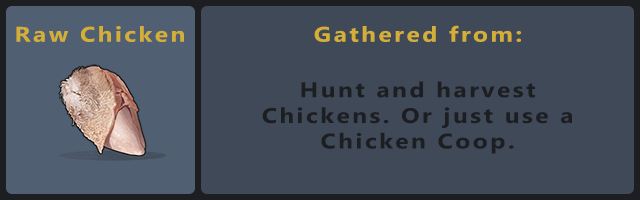

---
  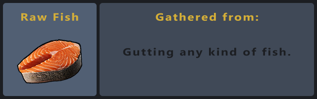

---
  

---
  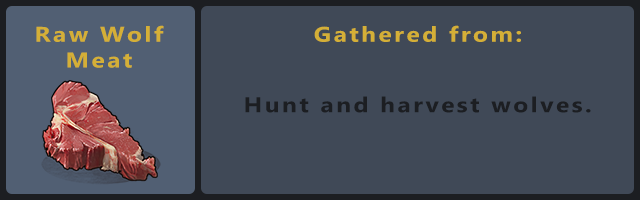

---
  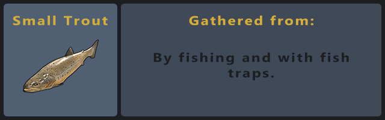

---
  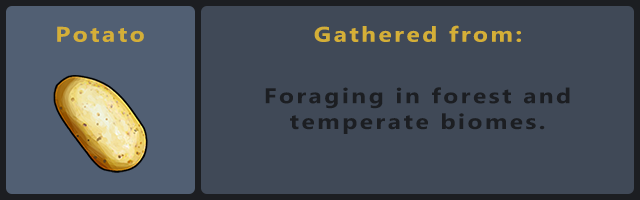

---
## Meal Overview
This section is sorted into the most frequently used and "good to know" meals. At the end, you will find a list of all other meals that are rarely used. Together, they represent all types of meals available on the server. 
  - You will also find the required ingredients, the effects the meal provides, and the duration of the meal's effects.
  - Every meal, other then Cheese, has a 15-second crafting time.

**TIP:** You can extend the duration of meals by using the Slow Metabolism Skill in the Cooking Skill Tree.

  
⏬<h3>MOST USED MEALS</h3>⏫ 

  ### Farming & Quests
  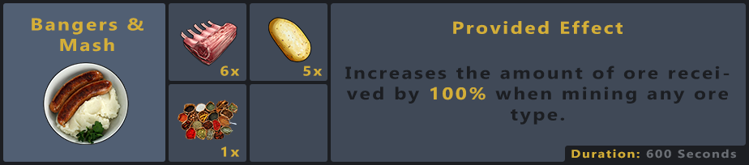
  
  - Best meal for Quartar Master Stones, Sulfur & Metal Ore T1-5 Quest.
---
  

  - Best meal for Quartar Master Wood T1-5 Quest.
---
  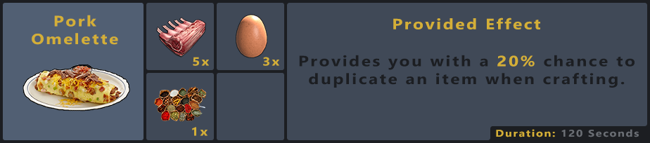

  - Best meal for Crafting Quests.
---
  

  - Best meal for harvesting player-grown plants (Hemp, Orchids etc.).
---
  

  - Best meal for harvesting animals (bone fragments).

---
  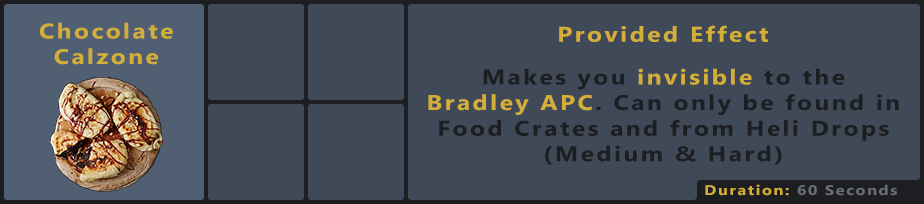

  - Best meal for tackling Bradley.

---

  
🔽<h3>GOOD MEALS</h3>🔼

  
  ### Good Meals to know about
  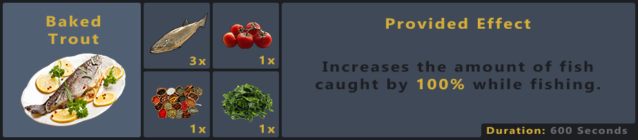

  - Best meal for fishing.
---
  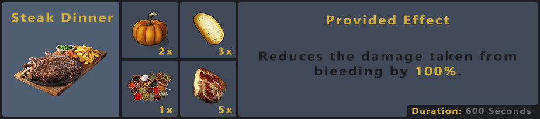
  
  - Good Meal for tackling challenges like helis, bradley etc.
---
  

  - Best healing meal.
---
  

  - Only Anti-Rad meal.
---
  

  - Good preparation meal to tackle helis for example.
---
  

  - Good meal for raiding.
---
  

  - Good prepartion meal to tackle helis or harbinger.
---
  

  - Best meal for heal share, for example taking down harbinger or legendary heli in a group.

---

  
⤵️ <h3>OTHER MEALS</h3>⤴️ 

  ### List of all the other meals
  - These meals only have niche use-cases, and are used rarely.

  
  
---
  

---
  

---
  

---
  

---
  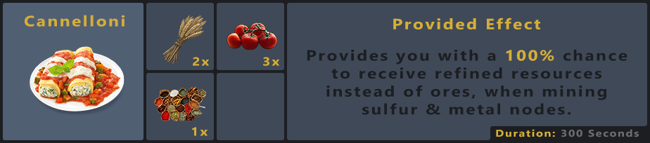
  
---
  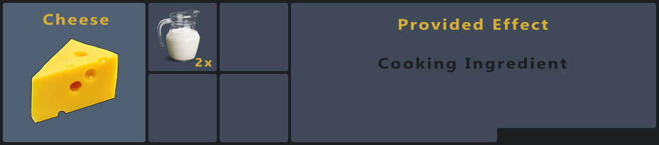

---
  

---
  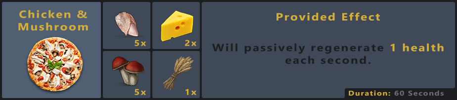

---
  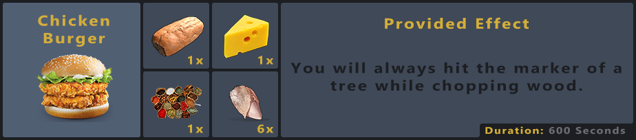

---
  

---
  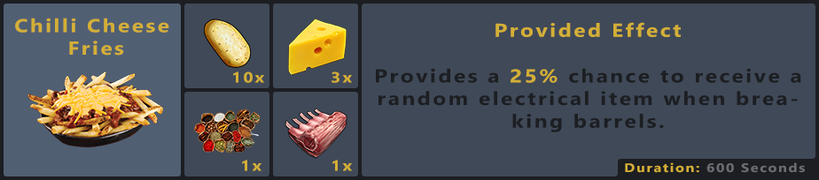

---
  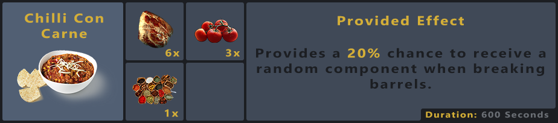

---
  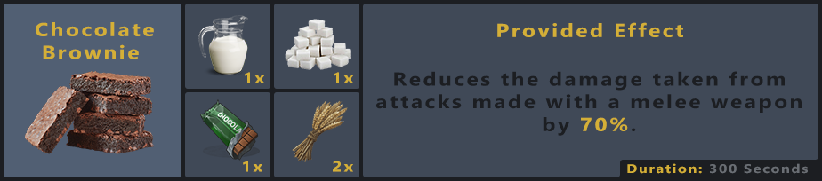

---
  

---
  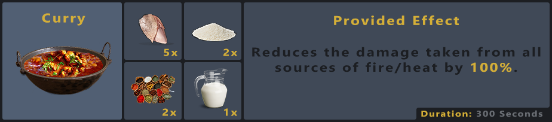

---
  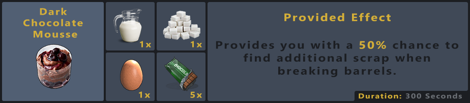

---
  

---
  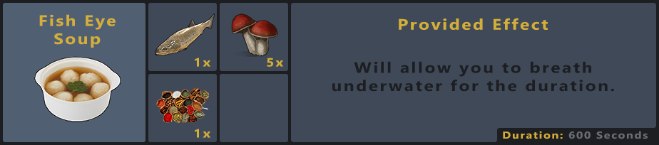

---
  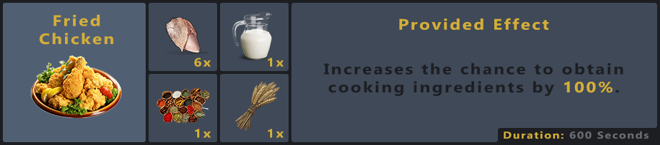

---
  

---
  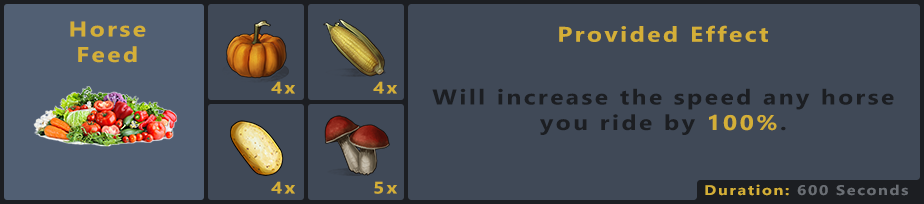

---
  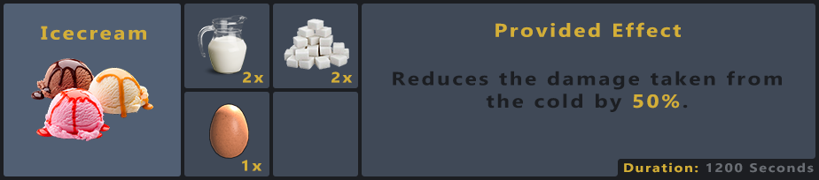

---
  

---
  

---
  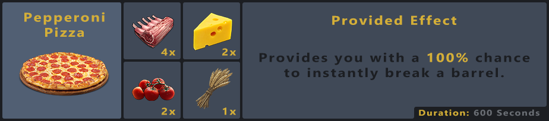

---
  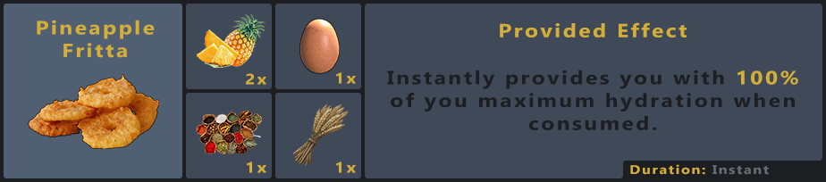

---
  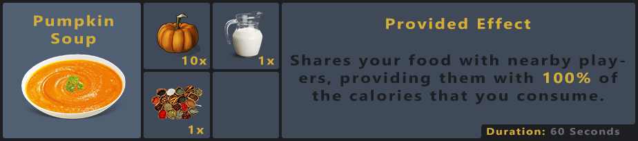

---
  

---
  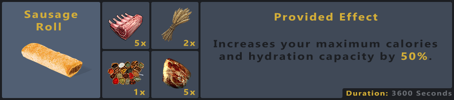

---
  

---
  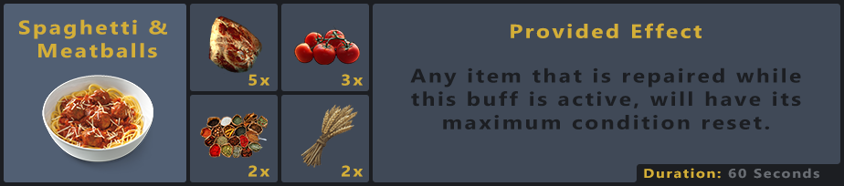

---
  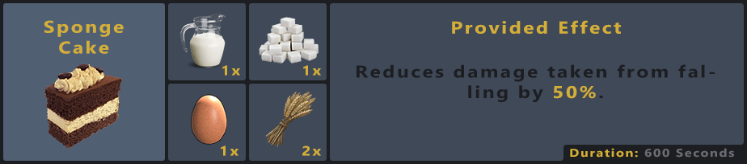

---
  

---
  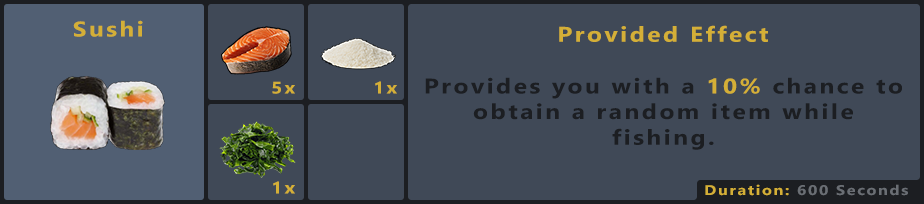

---
  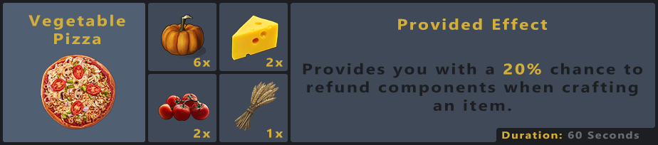

