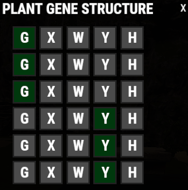

# /setgenes Guide

The `/setgenes` command lets you choose the gene setup for a seed.

This is useful for setting up the exact genes you want while avoiding the issue of triggering the cooldown without getting the desired result.

## Video Guide

@[youtube](https://www.youtube.com/watch?v=LkRuThloZjs){width=960 height=540}

## Important

Follow the steps below carefully. Using `/setgenes` without being ready, or not following the steps in order, may cause the cooldown to trigger without giving you the desired genes.

You can check your `/setgenes` cooldown with `/cd`.

## How To Use /setgenes Successfully

1. Have a **standard seed of any kind ready in your hotbar**.
2. Type `/stfix` in chat.
3. Type `/setgenes` in chat.
4. A window will pop up showing the available gene structure options, as shown below.

5. Select the gene configuration you want.
6. Click the **X** in the top-right corner to close the window.
7. Plant **1 seed** in a planter box.
8. Success — the planted seed should now have the selected genes.

## Troubleshooting

If it does not work as expected:

- Make sure you have a standard seed ready in your hotbar.
- Run `/stfix` before using `/setgenes`.
- Make sure you selected the desired gene setup in the menu.
- Close the menu with the **X** before planting.
- Check `/cd` to see whether the command is still on cooldown.
