# Skills

## Overview
## Skill Tree
You can open the skill tree overlay by using the /st command or by clicking the XP bar while your inventory is open. 
Clicking on **OVERVIEW** will show a description of all buttons and information within the overlay.

  
⏬<h3>OVERVIEW</h3>⏫

  
### In the top bar:
  - You will see the different skill tree sections; by default, the overlay always opens to the Mining skill tree.

---
### On the left side:
  - At the top, you will see a description of the effects granted at each level.
  - Below that, the following information is displayed (from top to bottom);
  - **Maximum Level**
    - Displays the maximum level you can reach for this skill..
  - **Level Up Button**
    - With this button you level the selected skill.
  - **Respec Cost**
    - Displays the amount of Scrap required to reset all skills in the selected section. Note that the cost increases each time you use this option.
  - **Respec Button**
    - Set every skill of the selected section to zero.
  - **Rested XP Pool**
    - Displays the amount of bonus XP gained from specific activities, such as mining.
    - As long as you have Rested XP, the experience points gained (e.g., from mining stone) will be displayed in blue.
  - **Current Level:**
    - Displays you your current level.
  - **XP**
    - Displays your total earned XP. The left value includes the accumulated Rested XP pool, while the right value shows your current XP.
  - **Available Points**
    - Displays the amount of unused skill points you have left.
  - **Prestige Level**
    - Displays your Prestige level once earned..
  - **Gain Prestige Button**
    - Once you reach Level 100, you can use this button to enter Prestige.
    - Clicking the button will display the benefits of Prestige. In this overlay, you can then choose to either confirm or cancel the process.
    - Please note: If you gain Prestige, your level and skill points will be reset to zero.
    - **TIP**: Before you prestige, complete Quartermaster T4-5 quests but don't turn them in yet. You can redeem them immediately after prestiging to level up again quickly.
  - **Ultimate Settings**
    - Displays different options you can toggle on or off. For example here you can move your XP bar to another place.
  - **Buff Settings**
    - Displays different options you can toggle on or off.
---
### In the middle of the overlay you will find:
  - The selected skill tree name.
  - How many skill points you've spended at this skill tree.
  - Displays the total number of skill points spent out of 999.
  - The various skills available within this skill tree.
      - The first row of skills is unlocked by default; each subsequent row requires at least 5 skill points to be spent in the tree to unlock. 
      - If a skill tree features an ultimate skill, you must spend at least 25 skill points to unlock it."
---
### On the right side:
  - Buff Information
      - Displays active skill buff information, such as the total percentage bonus to mining yield.

## Beginner Skills Guide
Take a look around all the differnt skills and decide what skills are suitable for your playstyle. 
But there are is one nesessary skill to learn; 

*You will find this skill in the combat skill tree*
- When fully leveled, this skill prevents all durability damage to weapons, tools, and other equipment.
---

## Recommended Early Skills
The most recommended skills are those that accelerate your leveling process. Following the previous section, we will focus on Quartermaster tasks again, so prioritize unlocking the following:

### Mining section
"While all skills in this tree are valuable, the following can be skipped for now or unlocked later.

  
🔽 <h3>SKILLS TO SKIP</h3> 🔼

  
  
  - This skill is unnecessary if you have already leveled up Maintenance.
  ---

  
  - It’s a 'nice-to-have' skill, but not essential. Keep in mind that refined materials do not count toward Quartermaster tasks.
  ---

  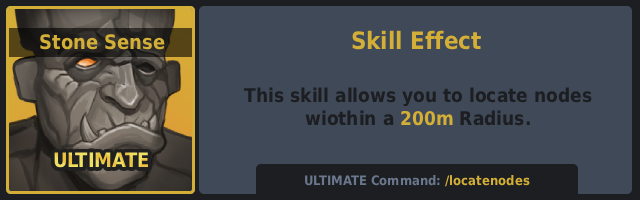
  - This ultimate can be unlocked later; it is not necessary during the early game.

---
### Woodcutting Section
In this section almost all skills are important,the only once you should skip for the early game are:
  - Each skill that isn't listed is ether not necassery or can be unlocked at a later stage.

  
🔽 <h3>SKILLS TO SKIP</h3> 🔼

  
  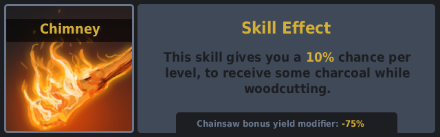
  - Charcole isn't importatend in the early game.
  ---

  
  - This skill is unnecessary if you have already leveled up Maintenance.
  ---

- TIP: Try to unlock the ultimate in this section as soon as possible; it will greatly increase your wood yield.
---

## Mid-Game Skills
### Tackling Raids, Bradleys & Helis
Once you start tackling Raids, Bradleys, and Helis, focus on the following skills of the raiding section:

 
  
🔽 <h3>MID GAME SKILLS</h3> 🔼

  
  
  - Max Level: Increases magazine capacity by 50%.
  ---
  **Raiding Section:**
  
  
  - Just to unlock the second row.
  ---

  
  - Prevents you from taking damage from your own rockets and explosives.
  ---

  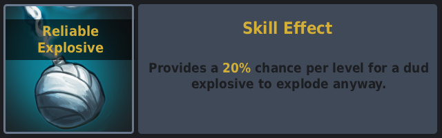
  - Your satchel charges will now always explode.
  ---

  
  - Speeds up the raiding process.
  ---

  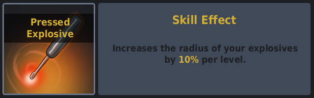
  - Speeds up the raiding process.
  ---

  
  - Easily destroys easy and medium-tier bases. It’s always a great way to start a raid. However, watch out for SAM sites, as they will shoot down your MLRS strike—make sure to destroy them first (if they are smoking, they are disabled).
  ---

**TIP:** If you plan on raiding, the 'Brits Boom Stick' is your best option—a revolver that fires rockets. For taking down Bradleys, focus on getting the 'Ashmaker,' which shoots HV rockets. Lastly, for taking out helicopters, the M2 is the ideal choice. All of these legendary weapons can be found
[here](legendary-weapons.md).

---
### Gaining Scrap/RP
When starting your first harvest of hemp or other plants, keep in mind that[legendary sets](legendary-sets.md) aren't the only requirement for a high yield. There are also 'must-have' skills for these tasks. Here are the most important skills to unlock in the Harvesting section:

  
🔽 <h3>HARVESTING SKILLS</h3>🔼 

  
  
  - Unlocks the second row and provides more resources when gathering wild collectibles.
  ---

  
  - Increases the yield from wild collectibles. 
  ---

  
  - Increases the yield from your **grown** crops.
  ---

  
  - Now grants the maximum yield from all wild collectibles.
  ---

  
  - You now receive the maximum yield from your grown plants.
  ---

  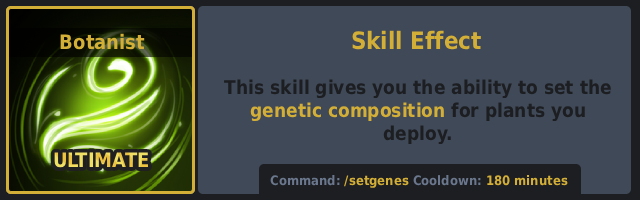
  - This is one of the best ultimates because it allows you to manually choose the genes.
  - Note that only the very next seed you plant will have the selected genes.
  ---

  - The remaining skills in this tree are not essential. However, feel free to unlock them if they suit your specific playstyle.

## Late-Game
There isn’t much to say about late game, if you are here it means you already know your preferred playstyle so i am sure you will already have unlocked the skills you are more interested in, what i can suggest is to unlock the Crafting Tree as it helps you with the more demanding quests like Boom for the Boom God.

## List of all Skills
Here you will find all available skills on the server, organized into sections.

  
⬇️<h3>MINING</h3>⬆️

  
  
  ---
  
  
  ---
  
  
  ---
  
  
  ---
  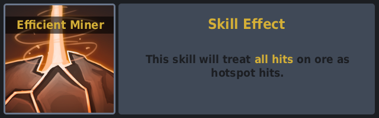
  
  ---
  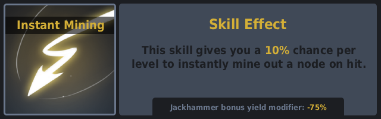
  
  ---
  
  
  ---
  
  
  ---
  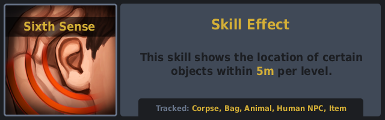
  
  ---
  

---

  
⬇️<h3>WOODCUTTING</h3>⬆️

  

  ---
  

  ---
  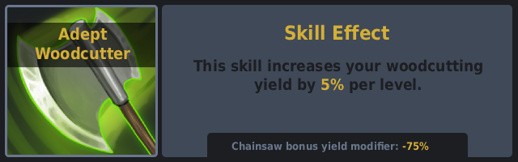

  ---
  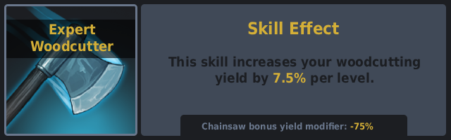

  ---
  

  ---
  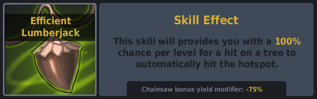

  ---
  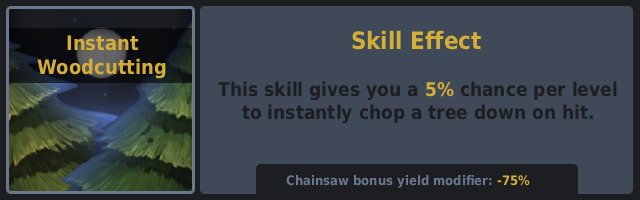

  ---
  

  ---
  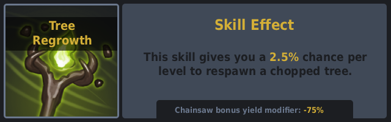

---

  
⬇️<h3>SKINNING</h3>⬆️

  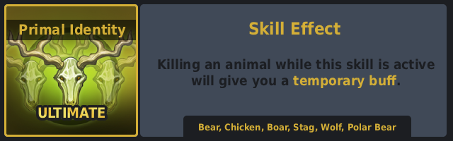

  ---
  

  ---
  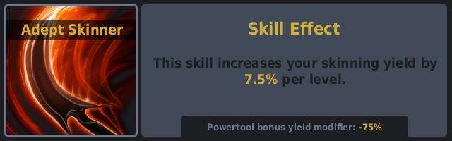

  ---
  

  ---
  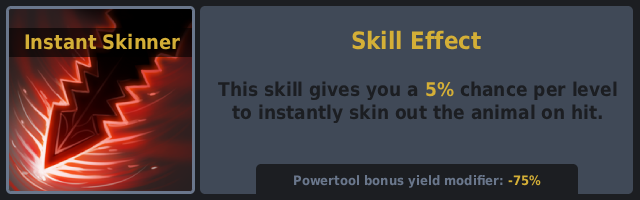

  ---
  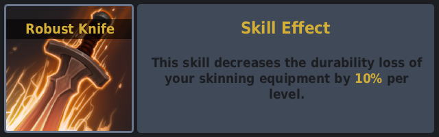

  ---
  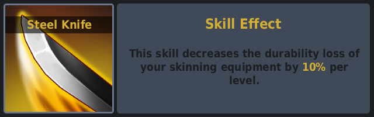

  ---
  

  ---
  

  ---
  

  ---
  

---

  
⬇️<h3>HARVESTING</h3>⬆️

  

  ---
  

  ---
  

  ---
  

  ---
  

  ---
  
  
  ---
  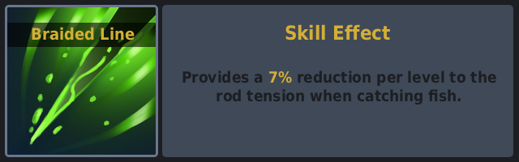

  ---
  

  ---
  

  ---
  

  ---
  

  ---
  

---

  
⬇️<h3>MEDICAL</h3>⬆️

  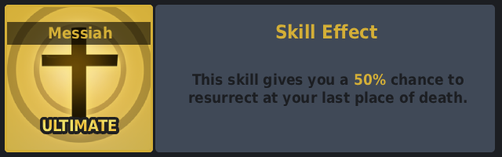

  ---
  

  ---
  

  ---
  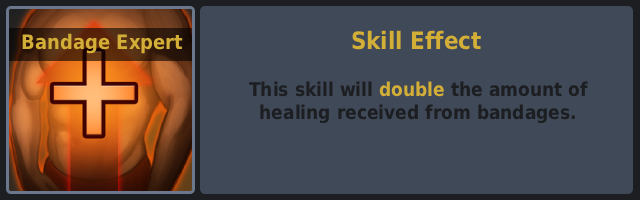

  ---
  

  ---
  

  ---
  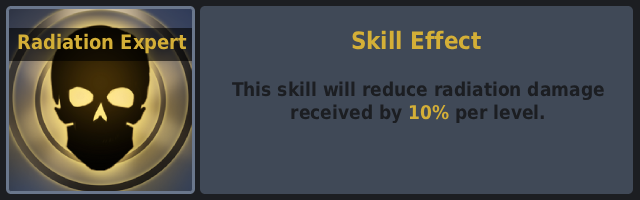

  ---
  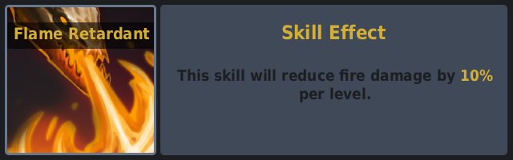

  ---
  

  ---
  

  ---
  

  ---
  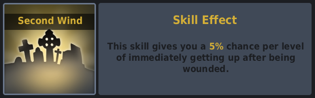

  ---
  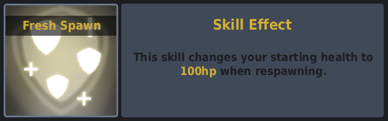

---

  
⬇️<h3>COMBAT</h3>⬆️

  

  ---
  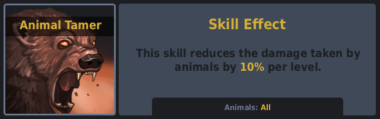

  ---
  

  ---
  

  ---
  

  ---
  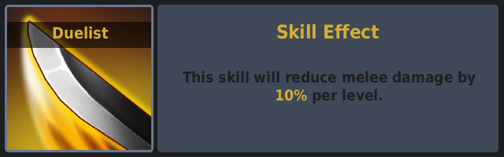

  ---
  

  ---
  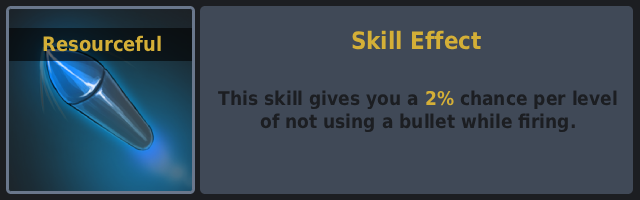

  ---
  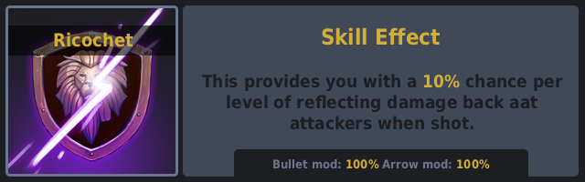

  ---
  

  ---
  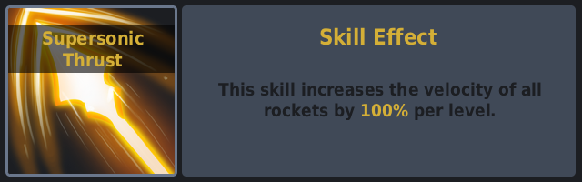

---

  
⬇️<h3>BUILD CRAFT</h3>⬆️

  
  

  ---
  

  ---
  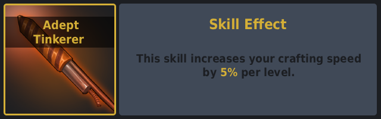

  ---
  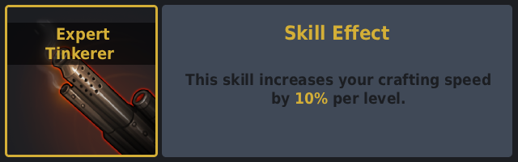

  ---
  

  ---
  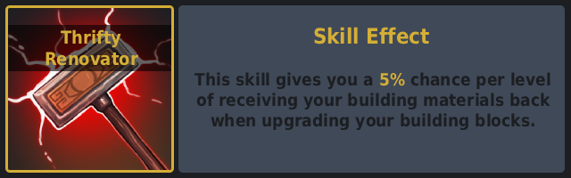

  ---
  

  ---
  

  ---
  
  
  ---
  

  ---
  

  ---
  

  ---
  

---

  
⬇️<h3>SCAVENGING</h3>⬆️

  

  ---
  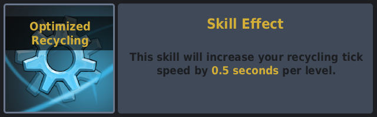

  ---
  

  ---
  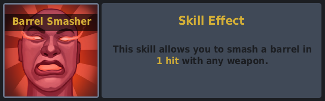

  ---
  

  ---
  

  ---
  

  ---
  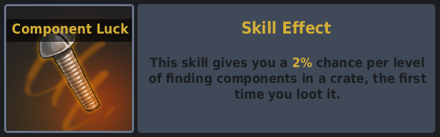

  ---
  

  ---
  

  ---
  

  ---
  
  
  ---
  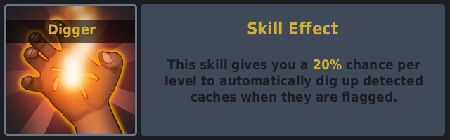
  
  ---
  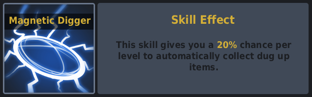

  
⬇️<h3>VEHICLES</h3>⬆️

  

  ---
  

  ---
  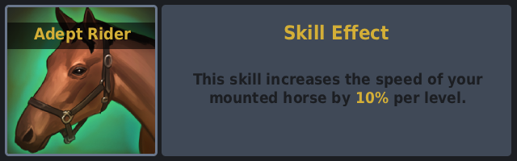

  ---
  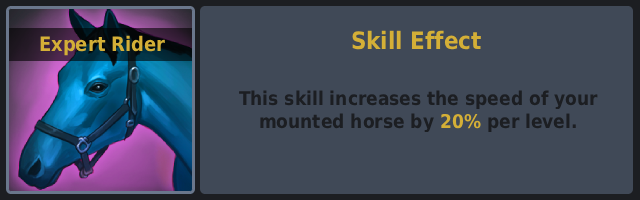

  ---
  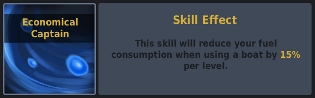

  ---
  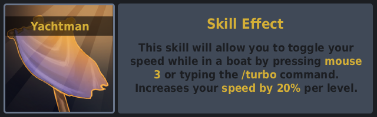

  ---
  

  ---
  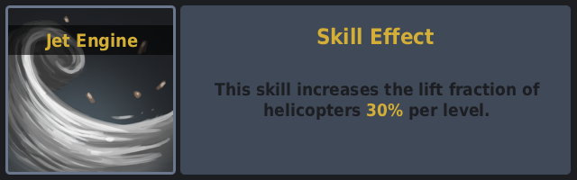

  ---
  

  ---
  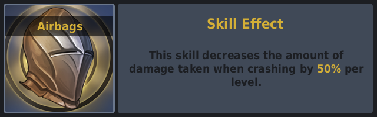

  ---
  

  ---
  

---

  
⬇️<h3>COOKING</h3>⬆️

  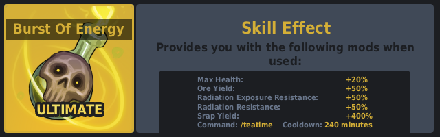

  ---
  

  ---
  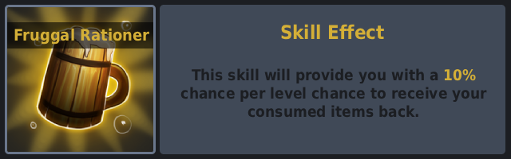

  ---
  

  ---
  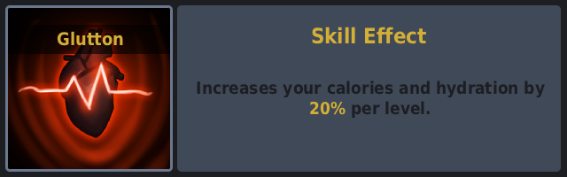

  ---
  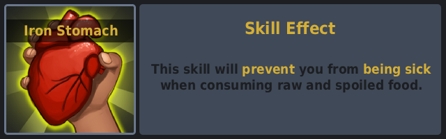

  ---
  

  ---
  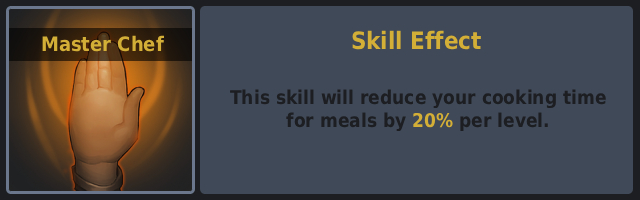

  ---
  

  ---
  

  ---
  

  ---
  

---

  
⬇️<h3>UNDERWATER</h3>⬆️

  

  ---
  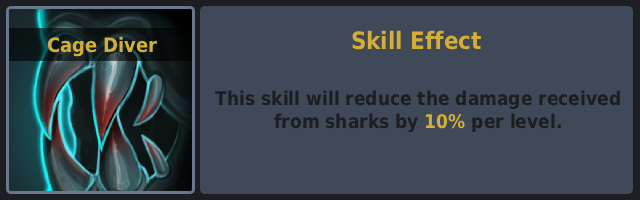

  ---
  

  ---
  

  ---
  

  ---
  

  ---
  

  ---
  

---

  
⬇️<h3>RAIDING</h3>⬆️

  

  ---
  

  ---
  

  ---
  

  ---
  

  ---
  

  ---
  

  ---
  

---

  
⬇️<h3>TEAM</h3>⬆️

  

  ---
  

  ---
  

  ---
  

  ---
  

  ---
  

